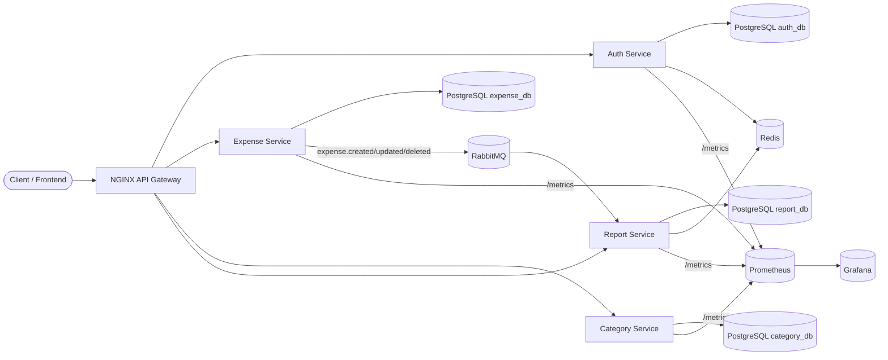
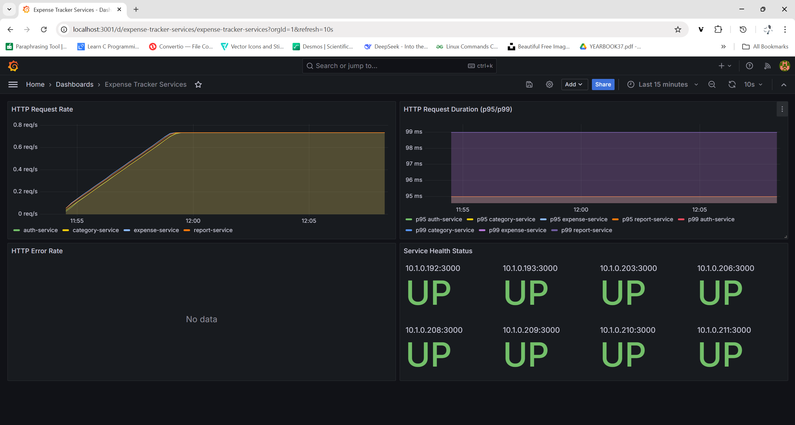

# Expense Tracker

Production-style microservices expense tracking app with a full backend stack and a Next.js UI. The repo includes services, tests, Docker Compose for local development, and Kubernetes manifests for deployment + monitoring.

## Project Snapshot
- **Architecture:** 4 Node.js microservices + API Gateway + event bus
- **Data:** PostgreSQL per service, Redis caching, RabbitMQ events
- **UI:** Next.js 16 + Tailwind (dashboard, expenses, categories, reports)
- **Observability:** Prometheus metrics endpoints + Grafana dashboards
- **Automation:** GitHub Actions CI for service tests

## Key Features
- JWT auth with refresh tokens
- CRUD expenses with filters, pagination, and stats
- Default + custom categories with budgets and spending checks
- Reports: monthly, category breakdown, trend, dashboard, CSV export
- Event-driven updates (`expense.created`, `expense.updated`, `expense.deleted`)
- API Gateway with rate limiting and report no-cache headers
- Metrics on every service (`/metrics`) for Prometheus scraping
- Kubernetes manifests with base + overlays + monitoring stack
- CI pipeline that runs tests per service

## Services & Ports (Docker Compose)
- API Gateway (NGINX): `http://localhost:8080`
- Auth Service: `http://localhost:3001`
- Expense Service: `http://localhost:3002`
- Category Service: `http://localhost:3003`
- Report Service: `http://localhost:3004`
- PostgreSQL: `5432`..`5435` (one DB per service)
- Redis: `6379`
- RabbitMQ: `5672` (AMQP), `http://localhost:15672` (UI)

## Tech Stack
- **Backend:** Node.js, Express, PostgreSQL, Redis, RabbitMQ
- **Frontend:** Next.js 16, React 19, Tailwind
- **Infra:** Docker Compose, NGINX, Kubernetes (Kustomize)
- **Monitoring:** Prometheus + Grafana
- **Testing:** Jest + Supertest

## Architecture (High Level)
Client → NGINX API Gateway → Auth / Expense / Category / Report Services  
Expense Service publishes events → RabbitMQ → Report Service  
Redis used for auth user caching and report dashboard cache.

## Architecture (Deep Dive)
The system is split into four independent services, each with its own database. The API Gateway routes traffic and applies rate limiting. Expense operations emit events that drive report cache invalidation.



### Auth & Service-to-Service Validation
- Auth Service validates JWTs directly in-service.
- Expense and Category Services call `Auth Service /api/v1/auth/validate-token` on each request.
- Report Service uses the same validate-token endpoint before serving report data.

### Reporting & Caching Behavior
- **Dashboard report:** cached in Redis for 10 minutes to speed up the UI.
- **Monthly report:** intentionally *not cached* to keep data real-time.
- Expense events trigger report cache invalidation via RabbitMQ.

## DevOps & Infrastructure Highlights
- **Docker Compose** brings up the full stack for local development.
- **Kubernetes** manifests cover base resources, overlays, ingress, HPA, and monitoring.
- **Monitoring**: services expose `/metrics`, Prometheus scrapes, Grafana dashboards visualize.

## Kubernetes (Local-First Setup)
Manifests live in `infrastructure/kubernetes/` and are organized with Kustomize.

**Base resources (`infrastructure/kubernetes/base/`):**
- Namespace, ConfigMaps, Secrets
- Postgres, Redis, RabbitMQ
- Deployments + Services for each microservice
- Ingress for API routing (`/api/v1/*`)
- HorizontalPodAutoscaler for all services

**Overlays (`infrastructure/kubernetes/overlays/`):**
- `dev`, `staging`, `production` overlays with image tags

**Monitoring (`infrastructure/kubernetes/monitoring/`):**
- Prometheus + Grafana manifests (datasources + dashboards)

Apply locally (example):
```bash
kubectl apply -k infrastructure/kubernetes/overlays/dev
kubectl apply -k infrastructure/kubernetes/monitoring
```

## Docker Compose (Local Stack)
`docker-compose.yml` is the fastest way to bring up the entire stack on a single machine. It runs:
- 4 Postgres containers (one per service)
- Redis + RabbitMQ
- Auth, Expense, Category, Report services
- NGINX API Gateway on `http://localhost:8080`

Start/stop:
```bash
docker-compose up -d --build
docker-compose logs -f
docker-compose down
```

Common overrides (optional):
- `DB_USER`, `DB_PASSWORD`
- `JWT_SECRET`
- `RABBITMQ_USER`, `RABBITMQ_PASSWORD`

## Frontend
Located in `frontend/`. It talks to the API Gateway and includes pages:
- `/register`, `/login`
- `/dashboard` (Report Service dashboard)
- `/expenses` (create/list/filter/stats/delete)
- `/categories` (list/create/delete + spending)
- `/reports` (monthly/category/trend/export)

Run locally:
```bash
cd frontend
npm install
npm run dev
```
Default API base URL is `http://localhost:8080`.  
For Kubernetes, see `frontend/K8S_SETUP.md` and `frontend/ENVIRONMENT.md`.

## Quick Start (Local)
```bash
# from project root
docker-compose up -d --build

# health checks
curl http://localhost:8080/health
curl http://localhost:3001/health
curl http://localhost:3002/health
curl http://localhost:3003/health
curl http://localhost:3004/health

# logs (follow)
docker-compose logs -f
```
RabbitMQ UI: `http://localhost:15672` (user: `expense_user`, pass: `expense_pass`).

## First-Time Usage (API Gateway)
1) Register
```bash
curl -X POST http://localhost:8080/api/v1/auth/register \
  -H "Content-Type: application/json" \
  -d '{"email":"you@example.com","password":"YourPassw0rd!","firstName":"You","lastName":"User"}'
```
2) Login (copy `accessToken`)
```bash
curl -X POST http://localhost:8080/api/v1/auth/login \
  -H "Content-Type: application/json" \
  -d '{"email":"you@example.com","password":"YourPassw0rd!"}'
```
3) Use the token
```bash
$TOKEN="Bearer <paste_access_token_here>"

# list categories (defaults are auto-seeded)
curl -H "Authorization: $TOKEN" http://localhost:8080/api/v1/categories

# create an expense
curl -X POST http://localhost:8080/api/v1/expenses \
  -H "Authorization: $TOKEN" -H "Content-Type: application/json" \
  -d '{"categoryId":1,"amount":25.50,"description":"Lunch","expenseDate":"2025-10-08"}'

# monthly report
curl -H "Authorization: $TOKEN" \
  "http://localhost:8080/api/v1/reports/monthly?year=2025&month=10"
```

## Configuration
Docker Compose works out of the box. Optional environment overrides:
- `DB_USER`, `DB_PASSWORD`
- `JWT_SECRET`
- `RABBITMQ_USER`, `RABBITMQ_PASSWORD`

Each service can also run standalone using its `.env.example` file.

## API Map (Gateway Routes)
- Auth: `POST /api/v1/auth/register`, `POST /api/v1/auth/login`, `POST /api/v1/auth/refresh`, `POST /api/v1/auth/logout`, `GET /api/v1/auth/me`
- Expenses: `POST /api/v1/expenses`, `GET /api/v1/expenses`, `GET /api/v1/expenses/:id`, `PUT /api/v1/expenses/:id`, `DELETE /api/v1/expenses/:id`, `GET /api/v1/expenses/stats`
- Categories: `GET /api/v1/categories`, `GET /api/v1/categories/:id`, `POST /api/v1/categories`, `PUT /api/v1/categories/:id`, `DELETE /api/v1/categories/:id`, `PUT /api/v1/categories/:id/budget`, `GET /api/v1/categories/:id/spending?month=YYYY-MM`
- Reports: `GET /api/v1/reports/monthly`, `GET /api/v1/reports/category`, `GET /api/v1/reports/trend`, `POST /api/v1/reports/export`, `GET /api/v1/reports/dashboard`

## Services 
**Auth Service**
- User registration/login, JWT access + refresh tokens
- `validate-token` endpoint used by other services
- Redis user cache for faster validation
- Database: `auth_db` (`users`, `refresh_tokens`)

**Expense Service**
- Expense CRUD, filters/pagination, stats
- Publishes `expense.*` events to RabbitMQ
- Database: `expense_db` (`expenses`)

**Category Service**
- Default + custom categories
- Budget management and spending checks
- Database: `category_db` (`categories`)

**Report Service**
- Monthly/category/trend reports + dashboard + CSV export
- Dashboard cached in Redis; monthly reports are real-time
- Consumes expense events to invalidate cached reports
- Database: `report_db` (`generated_reports`)

## Observability
- Each service exposes Prometheus metrics at `/metrics`.
- Prometheus/Grafana manifests live in `infrastructure/kubernetes/monitoring/`.

## Demo

**Live demo:** https://youtu.be/VgVtuHzXFb8



## Infrastructure & Deployment Assets
- `docker-compose.yml`: full local stack
- `infrastructure/nginx.conf`: API Gateway routing, rate limiting, and cache control
- `infrastructure/kubernetes/`: base + overlays + monitoring 

## Testing
Each service has Jest tests (unit + integration). Run per service:
```bash
cd services/auth-service
npm test
```
CI runs `npm ci` + `npm test` per service in `.github/workflows/ci-cd.yml`.

Run all service tests (example):
```bash
cd services/auth-service && npm test
cd services/expense-service && npm test
cd services/category-service && npm test
cd services/report-service && npm test
```

## Repo Map
```
services/                # Auth, Expense, Category, Report services
frontend/                # Next.js UI
infrastructure/          # Docker, NGINX, Kubernetes, monitoring
.github/workflows/       # CI pipeline
```

## Troubleshooting
- Ensure ports `8080`, `3001`–`3004`, `5432`–`5435`, `6379`, `5672`, `15672` are free
- On Windows, avoid OneDrive paths for Docker bind mounts
- Reset local data: `docker-compose down -v`
